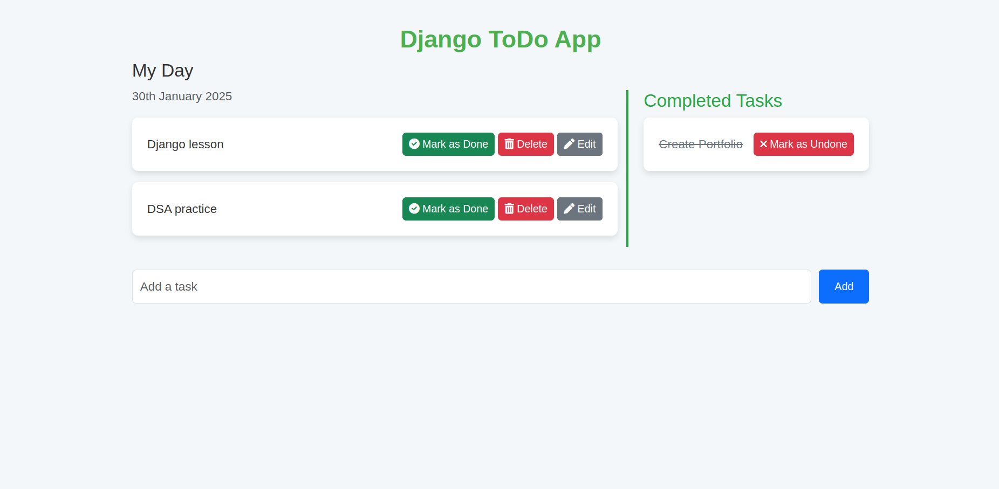
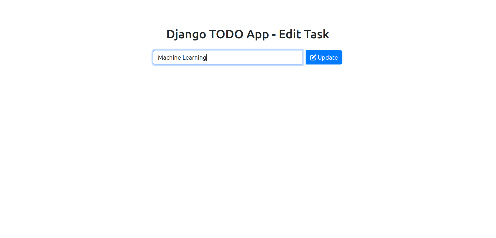

# 📝 Todo Project Using Django


## 📌 Overview
**Todo Project Using Django** is a simple task management web application that allows users to **add, edit, complete, and delete tasks**. It is built using Django for the backend and Bootstrap for the frontend, ensuring a smooth and responsive UI.

## 🚀 Features
✅ Add new tasks  
✅ Edit existing tasks  
✅ Mark tasks as completed  
✅ Delete tasks  
✅ Bootstrap-powered responsive UI  
✅ Django Forms for clean form handling  
✅ Secure with CSRF protection  

## 📸 Screenshots

### 🖥️ Home Page


### ✏ Edit Task Page



## 🛠️ Tech Stack
- **Backend:** Django (Python)  
- **Frontend:** HTML, Bootstrap, Font Awesome  
- **Database:** SQLite (default, can be switched to PostgreSQL/MySQL)  
- **Version Control:** Git & GitHub  

## 📂 Project Structure

```sh
Todo_Project_Using_Django/
├── todo_project/             # Django Project Root
│   ├── settings.py           # Django Settings
│   ├── urls.py               # Project URL Configurations
│   ├── wsgi.py               # WSGI Application
│   ├── asgi.py               # ASGI Application
│   ├── __init__.py
│
├── todo_app/                 # Main Application
│   ├── migrations/           # Database Migrations
│   ├── templates/            # HTML Templates
│   ├── static/               # Static Files (CSS, JS, Images)
│   ├── admin.py              # Django Admin Panel Config
│   ├── models.py             # Database Models
│   ├── views.py              # Application Views
│   ├── urls.py               # App-Specific URLs
│   ├── forms.py              # Django Forms
│   ├── tests.py              # Unit Tests
│   ├── __init__.py
│
├── db.sqlite3                # Default SQLite Database
├── manage.py                 # Django Management Script
├── requirements.txt          # Project Dependencies
├── README.md                 # Project Documentation
└── .gitignore                # Git Ignore File

```


## ⚡ Installation & Setup
Follow these steps to set up the project locally:

### **1️⃣ Clone the Repository**
```sh
git clone https://github.com/minhazriyam/Todo_Project_Using_Django.git
cd Todo_Project_Using_Django
```

### **2️⃣ Create a Virtual Environment**
```sh
python -m venv venv
source venv/bin/activate   # On macOS/Linux
venv\Scripts\activate      # On Windows
```


### **3️⃣ Install Dependencies**
```sh
pip install -r requirements.txt
```
### **4️⃣ Apply Migrations**
```sh
python manage.py migrate
```
Now open http://127.0.0.1:8000/ in your browser to access the app.

### **5️⃣ Run the Development Server**
```sh
python manage.py runserver
```

## 🔧 Usage Guide

### ✅ Add Tasks
- Enter a task in the input field.
- Click the **"Add"** button to save it.

### ✏ Edit Tasks
- Click the **"Edit"** button next to a task.
- Modify the task name in the edit field.
- Click **"Update"** to save changes.

### ✅ Mark as Done
- Click the **"Mark as Done"** button to complete a task.
- The task will be marked as completed.

### ❌ Delete Tasks
- Click the **"Delete"** button next to a task.
- Confirm the deletion to remove the task permanently.

## 📜 License
This project is **open-source** and available under the **MIT License**.  
Feel free to modify and distribute it as per the license terms.

---

## ⭐ Acknowledgments
Special thanks to:
- [Django Documentation](https://docs.djangoproject.com/) for guidance.
- [Bootstrap](https://getbootstrap.com/) & [Font Awesome](https://fontawesome.com/) for UI styling.


